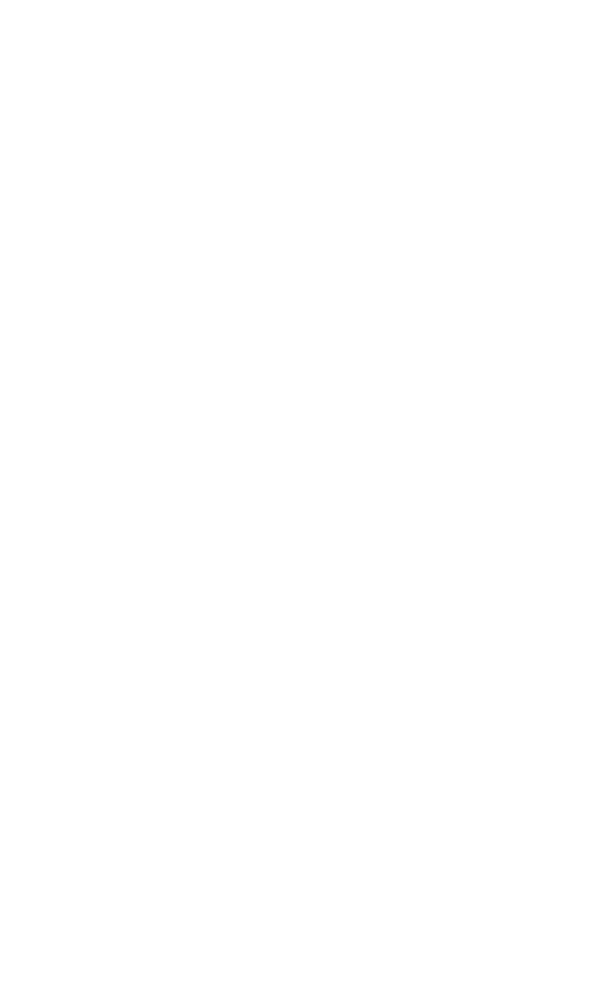

# Pulse-Check-API — Watchdog Sentinel

A Dead Man's Switch API for monitoring remote devices. Devices register a heartbeat monitor with a countdown timer. If a device fails to send a heartbeat before the timer expires, the system automatically fires an alert.

Built with **Java  & Spring Boot.**

## Architecture Diagram


## How It Works

The service is built in four layers:

**Controller** (`MonitorController`) receives all HTTP requests and delegates
to the service layer. It handles registration, heartbeat, pause, recovery,
and status queries, returning appropriate HTTP status codes for each outcome.

**Service** (`MonitorService`) contains the core business logic — state
transitions, timer resets, and alert triggering. All monitor state lives in
a `ConcurrentHashMap` for thread-safe in-memory storage.

**Scheduler** (`MonitorScheduler`) runs every 5 seconds in the background.
It scans all active monitors and marks any with an expired timer as `DOWN`,
firing a log alert immediately.

**Model** (`Monitor`) represents a single device and tracks its current
state through four possible statuses: `ACTIVE`, `PAUSED`, `DOWN`,
and `UNDER_RECOVERY`.

---

## Set Up
**Requirements:** Java 17+, Maven 3.8+

##### Clone repository
```bash
git clone https://github.com/Tipow/Pulse-Check-API.git
```

#### Run
```
mvn spring-boot:run
```

The API starts on http://localhost:8080


---
## Endpoints
* POST /monitors
* POST /monitors/{id}/heartbeat
* POST /monitors/{id}/pause
* POST /monitors/{id}/recovery
* POST /monitors/{id}/recovery/complete
* GET /monitors/{id}
* GET /monitors
* DELETE /monitors/{id}

---

## API Documentation

### ```POST /monitors``` — Register a monitor

**Request Body:**
```json
{
  "id": "device-123",
  "timeout": 60,
  "alert_email": "admin@critmon.com"
}
```

**Response — 201 Created**
```json
{
  "message": "Monitor created successfully",
  "id": "device-123",
  "expires_at": "2025-05-08T12:01:00Z"
}
```

**Possible Errors**
- `400` — missing id or timeout ≤ 0
- `409` — monitor with that id already exists

---

### ```POST /monitors/{id}/heartbeat``` — Reset the countdown

**Response — 200 OK**
```json
{
  "remainingSeconds": 60,
  "message": "Heartbeat received. Timer resets.",
  "expiresAt": "2025-01-01T12:02:00Z"
}
```

**Possible Errors**
- `404` — monitor not found
- `400` — monitor is DOWN or UNDER_RECOVERY

---

### ```POST /monitors/{id}/pause``` — Pause monitoring

Stops the countdown completely. No alerts will fire while paused.
Sending a heartbeat automatically un-pauses and restarts the timer.

**Response — 200 OK**
```json
{
  "status": "PAUSED",
  "message": "Monitor paused"
}
```

**Possible Errors**
- `404` — monitor not found
- `400` — monitor is already PAUSED or DOWN

---

### ```POST /monitors/{id}/recovery``` — Monitor under recovery

Moves a DOWN monitor into UNDER_RECOVERY. The scheduler will not
re-alert while recovery is in progress.

**Response — 200 OK**
```json
{
  "id": "device-123",
  "message": "Monitor is now under recovery",
  "status": "UNDER_RECOVERY"
}
```

**Errors**
- `404` — monitor not found
- `400` — monitor is not DOWN

---

### ```POST /monitors/{id}/recovery/complete``` — Complete recovery

Brings the device back online. Resets the timer and sets status to ACTIVE.

**Response — 200 OK**
```json
{
  "id": "device-123",
  "status": "ACTIVE",
  "expiresAt": "2025-05-08T12:05:00Z",
  "message": "Monitor recovery complete. Now active."
}
```

**Possible Errors**
- `404` — monitor not found
- `400` — monitor is not UNDER_RECOVERY

---

### ```GET /monitors/{id}``` — Get a single monitor

**Response — 200 OK**
```json
{
  "id": "device-123",
  "status": "ACTIVE",
  "expiresAt": "2025-01-01T12:01:00Z",
  "remainingSeconds": 47
}
```

---

### ```GET /monitors``` — List all monitors

Returns an array of all registered monitors.

---

### DELETE /monitors/{id} — Remove a monitor

**Response — 200 OK**
```json
{
  "message": "Monitor deleted successfully",
  "id": "device-123"
}
```

---

## Developer's Choice: Recovery Workflow

### What I added

Two new endpoints: `POST /monitors/{id}/recovery` and
`POST /monitors/{id}/recovery/complete`, along with a new
`UNDER_RECOVERY` state.

### Why

The base spec handles the failure case (DOWN) but not what happens
after. In a real infrastructure monitoring scenario, a device goes
down and a technician is dispatched. Without a recovery state, the
only options are:

1. Delete the monitor and re-register — losing alert history
2. Leave it in DOWN indefinitely — making the status meaningless

The recovery flow gives operations teams a structured path:
- `POST /recovery` signals that someone is actively repairing the device
- The scheduler skips monitors in `UNDER_RECOVERY`, preventing repeat alerts
- `POST /recovery/complete` brings it back online cleanly

This mirrors how real incident management works.
